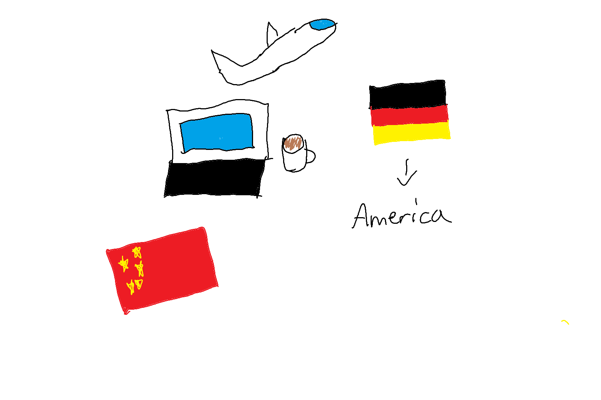

  <h1>Eric's Blog</h1>

  

  

  

Hello! My name is Eric, I am currently a Sophomore enrolled at DNHS. This is my blog dedicated to my AP CSP class

***
# About me

I was born in Maryland, but I quickly moved to Germany when I was just a few months old. After my 6th birthday we moved to San Diego, where I would spend my time until 5th grade, where we moved back to Germany yet again, where i stayed until 7th grade. For the final time, I moved back to San Diego during the middle of 7th grade.

Computer Science is one of my hobbies, I've always had interest for computer related things such as Python, Cybersecurity, and Linux Systems. 

I also post on Youtube channel from time to time (see link below), and here is my most popular video:

<iframe width="560" height="315" src="https://www.youtube.com/embed/vVOLzD9Wfu0?si=cR5fIrn8T8VcDFL8" title="YouTube video player" frameborder="0" allow="accelerometer; autoplay; clipboard-write; encrypted-media; gyroscope; picture-in-picture; web-share" allowfullscreen></iframe>

 

If you have time, feel free to check out my [Github!](https://github.com/Be1uga4life)

<h1 span style="color: white; font-size: 20px;">Socials </h1>

